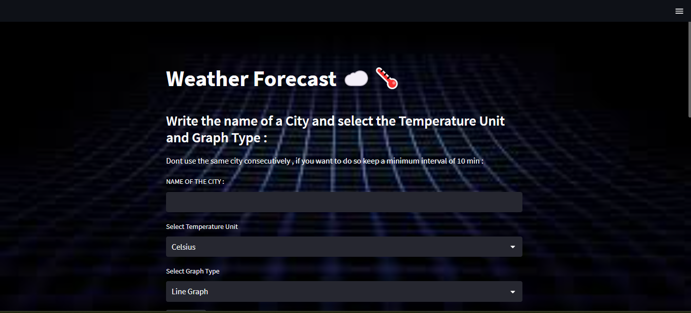

# Weather Forecast App
https://weather-forecaster-app-sarthak.herokuapp.com/
## Project Context
We look at weather data and the future predicted weather to plan our days accordingly. Having visualizations helps us understand that data better.
The weather app shows 5 days future forecast for the given city with maximum and minimum tempratures in 2 forms , either in bar chart or in line chart .
It also gives facility to get tomorrow's forecast at any given time 

### Tech Used 
- Python
- Streamlit 
- Pyowm library

## Deployment

The app is deployed on heroku platform 

## Screenshots

